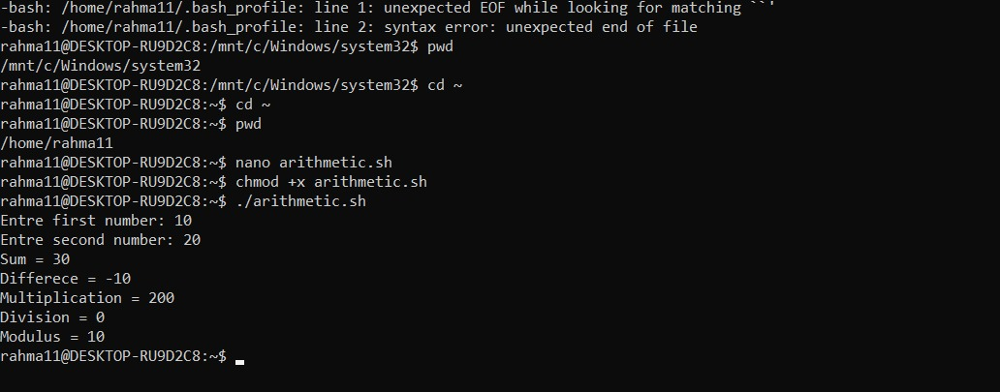

  

# ➗ Assignment 1 — Arithmetic Operations

A Bash script that takes two integers from the user and computes five operations on them: sum, difference, multiplication, division, and modulus.

<sub>📎 Part of the ITI Linux & Shell Scripting review series — every script is actually run and its output checked value by value, not just glanced at.</sub>

---

### 🧭 At a Glance

| | |
|---|---|
| **File** | `arithmetic.sh` |
| **Input** | Two integers |
| **Output** | Sum, Difference, Multiplication, Division, Modulus |
| **Review status** | ✅ Logically correct — a few cosmetic notes |

---

### 📌 Requirements

> Ask the user for two integers, and display the Sum, Difference, Multiplication, Division, and Modulus.

Expected output shape:

```
Enter first number: 20
Enter second number: 5

Sum = 25
Difference = 15
Multiplication = 100
Division = 4
Modulus = 0
```

---

### 🛠️ How to Run

```bash
cd ~
nano arithmetic.sh
chmod +x arithmetic.sh
./arithmetic.sh
```

---

### 🧪 Test Run

Input: `10` and `20`

```
Entre first number: 10
Entre second number: 20
Sum = 30
Differece = -10
Multiplication = 200
Division = 0
Modulus = 10
```



**Manual verification of every result:**

| Operation | Calculation | Expected | Actual | Status |
|---|---|---|---|---|
| Sum | 10 + 20 | 30 | 30 | ✅ |
| Difference | 10 − 20 | -10 | -10 | ✅ |
| Multiplication | 10 × 20 | 200 | 200 | ✅ |
| Division | 10 ÷ 20 (integer) | 0 | 0 | ✅ |
| Modulus | 10 % 20 | 10 | 10 | ✅ |

All values are arithmetically correct, 100%.

---

### 🔍 Review Notes

1. **Typos in the printed messages** (no impact on the math, but worth fixing):
   - `Entre` → `Enter` (appears twice)
   - `Differece` → `Difference`

2. **`Division = 0` is correct, not a bug.** Bash performs integer division, so `10/20` rounds down to the nearest whole number. If a decimal result is needed instead:
   ```bash
   division=$(echo "scale=2; $num1 / $num2" | bc)
   ```

3. **Unrelated observation:** an error about `~/.bash_profile` appeared before the script ran (`unexpected EOF while looking for matching backtick`). It has nothing to do with `arithmetic.sh` itself, but it's worth reviewing that file so the message doesn't keep popping up on every new terminal.

---

### 🏁 Verdict

> ✅ The script meets every requirement, and the arithmetic is fully correct. The only thing left is fixing the typos, and optionally switching Division to a decimal result if that's needed.

---

<sub>✍️ Reviewed as part of the ITI Embedded Systems track — verified command by command, not just glanced at.</sub>
