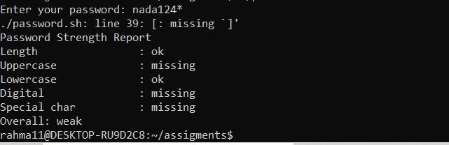

  

# 🔐 Assignment 3 — Password Strength Checker

A Bash script that takes a password from the user and checks its strength against 5 conditions: length, uppercase letter, lowercase letter, digit, and special character.

<sub>📎 Part of the ITI Linux & Shell Scripting review series — every script is actually run and its output checked value by value, not just glanced at.</sub>

---

### 🧭 At a Glance

| | |
|---|---|
| **File** | `password.sh` |
| **Required conditions** | Length ≥ 8, Uppercase, Lowercase, Digit, Special char |
| **Review status** | ❌ A syntax error + faulty logic need fixing before submission |

---

### 📌 Requirements

Expected output shape:

```
Password Strength Report

Length          : OK
Uppercase       : OK
Lowercase       : OK
Digit           : Missing
Special Char    : OK

Overall: Weak
```

---

### 🧪 Test Run

Password entered: `nada124*`

```
./password.sh: line 39: [: missing `]'
Password Strength Report
Length          : ok
Uppercase       : missing
Lowercase       : ok
Digital         : missing
Special char    : missing

Overall: weak
```



---

### 🔍 Manual Verification of `nada124*`

| Condition | Actually in the password | Result shown | Should be | Status |
|---|---|---|---|---|
| Length ≥ 8 | Exactly 8 characters | ok | OK | ✅ Correct |
| Uppercase | No uppercase letter | missing | Missing | ✅ Correct |
| Lowercase | `n a d a` lowercase letters | ok | OK | ✅ Correct |
| **Digit** | **Contains `1`, `2`, `4`** | **missing** | **OK** | ❌ **Wrong** |
| **Special char** | **Contains `*`** | **missing** | **OK** | ❌ **Wrong** |

In reality this password should show 4 out of 5 conditions met (all except Uppercase), but the script reports Digit and Special char as "missing" even though both are present.

---

### ⚠️ Issues to Fix

**1. Syntax Error:**
```
./password.sh: line 39: [: missing `]'
```
An `if [ ... ]` condition on line 39 is missing its closing bracket `]`, or a space before it.

**2. The Digit and Special Char check logic is wrong** — most likely caused by the same line with the syntax error. Suggested fix:

```bash
if [[ "$password" =~ [0-9] ]]; then
    digit="OK"
else
    digit="Missing"
fi

if [[ "$password" =~ [^a-zA-Z0-9] ]]; then
    special="OK"
else
    special="Missing"
fi
```

**3. The overall result** currently shows "weak" because of these errors, when it should be much stronger (4 out of 5).

---

### 🏁 Verdict

> ❌ The report layout (Password Strength Report) matches the required format, but there's a real syntax error on line 39, and the Digit/Special Char logic is wrong. Both need fixing before submission, since the current Overall result isn't accurate.

---

<sub>✍️ Reviewed as part of the ITI Embedded Systems track — verified command by command, not just glanced at.</sub>
