  

# 🧩 Assignment 4 — Customize Your Linux Terminal

A set of custom shell commands that make everyday terminal work — navigating folders, searching inside files, creating and removing files and directories — faster and friendlier. Every command is a small shell script living in `~/mybin`, exposed globally through `PATH`.

<sub>📎 Part of the ITI Linux & Shell Scripting series — reviewed and documented command-by-command, not just copy-pasted output.</sub>

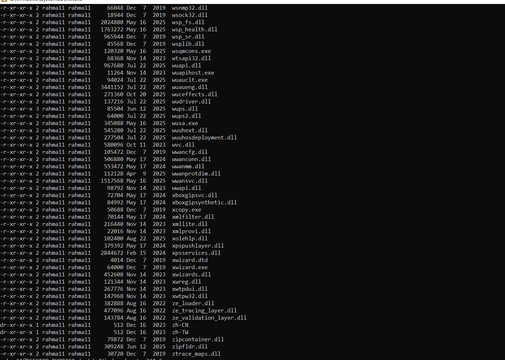

---

### 🧭 At a Glance

| | |
|---|---|
| **Commands added** | 9 |
| **Location** | `~/mybin`, added to `PATH` |
| **Status** | ✅ Completed & verified |

---

### 🛠️ Setup

**1. Create a dedicated folder for the scripts**
```bash
mkdir -p ~/mybin
# move / create each script (print_content, go_to, search, show_file,
# remove, make_dir, create_file, copy_file, move_file) inside ~/mybin
```
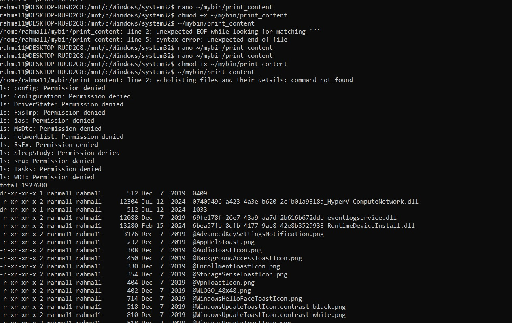

**2. Make them executable**
```bash
chmod +x ~/mybin/*
```
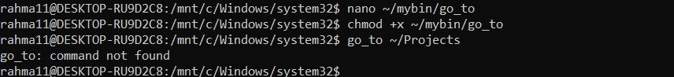

**3. Add `~/mybin` to `PATH`** — append this line to `~/.bashrc`:
```bash
export PATH=$PATH:/home/rahma11/mybin
```
then reload it:
```bash
source ~/.bashrc
```
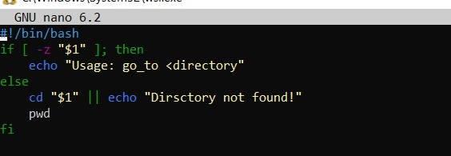

Once this is done, every command below works from **any directory**, just like a built-in Linux command.

---

### 🔍 The Commands

| # | Command | What it does | Demo |
|---|---|---|---|
| 1 | `print_content` | Displays the contents of the current directory | 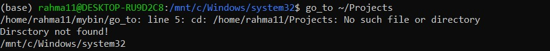 |
| 2 | `go_to <dir>` | Changes the working directory to the given path | 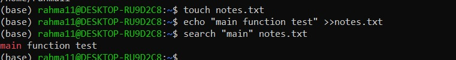 |
| 3 | `search "keyword" file` | Finds a keyword inside a file, highlighting matches | 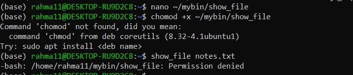 |
| 4 | `show_file <file>` | Prints a file's contents with line numbers | 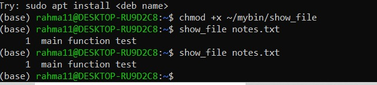 |
| 5 | `remove <file>` | Deletes a file, but asks for confirmation first | 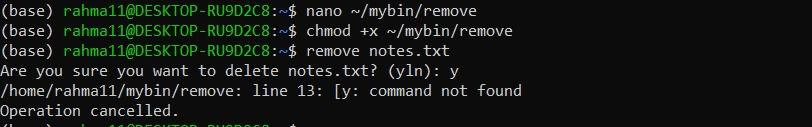 |
| 6 | `make_dir <path>` | Creates a full directory hierarchy, including missing parents | 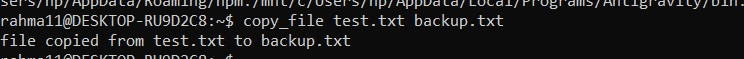 |
| 7 | `create_file <name>` | Creates a new, empty file | 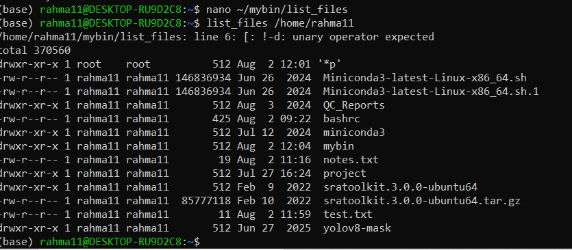 |
| 8 | `copy_file <src> <dst>` | Copies a file to a new location | 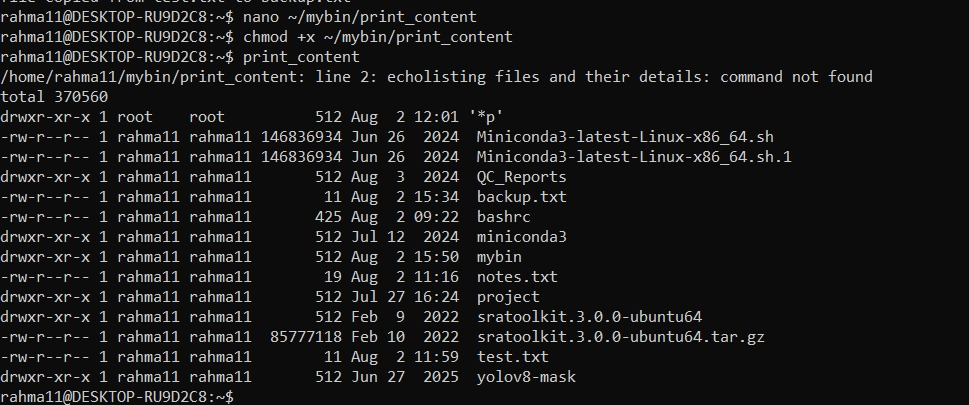 |
| 9 | `move_file <src> <dst>` | Moves or renames a file | 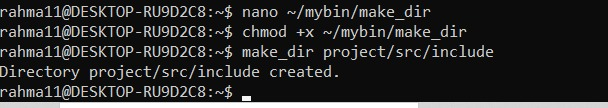 |

---

### 📁 Suggested Repository Structure

```
mybin/
├── print_content
├── go_to
├── search
├── show_file
├── remove
├── make_dir
├── create_file
├── copy_file
└── move_file
```

---

### 📝 Notes

- All scripts live in `~/mybin` and are exposed globally via `PATH`.
- Run `chmod +x ~/mybin/*` again whenever a new script is added.
- After editing `~/.bashrc`, always run `source ~/.bashrc` (or open a new terminal tab) for the changes to take effect.

---

### 🏁 Verdict

> ✅ All 9 commands work as expected from any directory, turning routine file operations into short, memorable commands.

---

<sub>✍️ Part of a personal ITI Linux & Shell Scripting portfolio.</sub>
