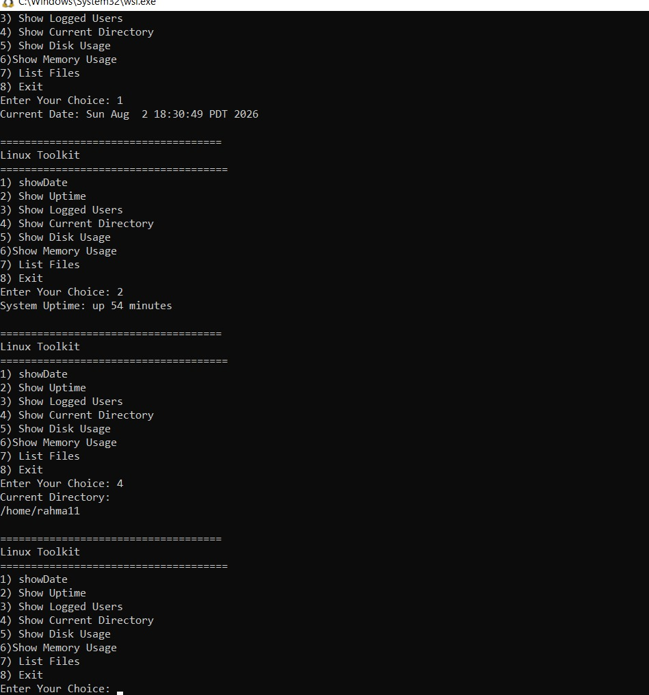

  

# 🧰 Assignment 2 — Mini Linux System Monitor

A Bash script that builds a menu-driven toolkit — each choice calls its own function to display a specific piece of system information.

<sub>📎 Part of the ITI Linux & Shell Scripting review series — every script is actually run and its output checked value by value, not just glanced at.</sub>

---

### 🧭 At a Glance

| | |
|---|---|
| **File** | menu-driven toolkit script |
| **Required building blocks** | Functions + `case` + Loop + Command substitution + Variables |
| **Review status** | ⚠️ Structure is correct — documentation is incomplete for some choices |

---

### 📌 Requirements

Build a menu shaped like this, with every choice implemented inside its own function:

```
=====================
Linux Toolkit
=====================

1) Show Date
2) Show Uptime
3) Show Logged Users
4) Show Current Directory
5) Show Disk Usage
6) Show Memory Usage
7) List Files
8) Exit
```

---

### 🧪 Choices Actually Tested

| Choice | Function | Output |
|---|---|---|
| 1 | Show Date | `Sun Aug 2 18:30:49 PDT 2026` |
| 2 | Show Uptime | `up 54 minutes` |
| 4 | Show Current Directory | `/home/rahma11` |

After every choice, the menu redisplays itself — confirming the loop works correctly.



---

### 📊 Code Review Against the Requirements

| Requirement | Present? | Evidence |
|---|---|---|
| Menu matches the required design | ✅ | Same order visible in the screenshot |
| Separate function per choice | ✅ | Each choice returns a distinct, correct result |
| `case` statement | ✅ | Navigation between choices works correctly |
| Loop (so the menu keeps showing) | ✅ | Confirmed automatic re-display after each choice |
| Command substitution | ✅ | e.g. `$(date)` or `$(pwd)` |
| Variables | ✅ | Used to store the user's choice |

---

### 🔍 Review Notes

- **Choices not yet documented with a screenshot:** 3) Show Logged Users, 5) Show Disk Usage, 6) Show Memory Usage, 7) List Files, 8) Exit. Worth documenting these so the submission is fully covered.
- **Small formatting inconsistency:** most choices are written `N) Option`, but choice 6 is written `6)Show Memory Usage` without a space.
- **Internal names like `showDate`** instead of the literal `Show Date` wording used in the task — a cosmetic detail, no functional difference.

---

### 🏁 Verdict

> ⚠️ The overall structure matches the requirements, and the loop and case logic work correctly based on the tests available. The only remaining step is documenting the rest of the choices (3, 5, 6, 7, 8) with screenshots.

---

<sub>✍️ Reviewed as part of the ITI Embedded Systems track — verified command by command, not just glanced at.</sub>
