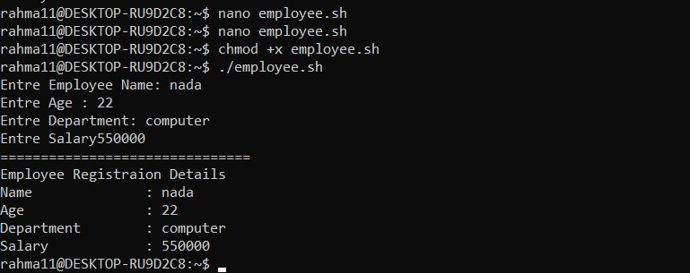

  

# 🧾 Assignment 5 — Employee Registration System

A shell script that collects a new employee's details interactively and prints them back in a clean, formatted summary.

<sub>📎 Part of the ITI Linux & Shell Scripting series — reviewed and documented command-by-command, not just copy-pasted output.</sub>

---

### 🧭 At a Glance

| | |
|---|---|
| **Script** | `employee.sh` |
| **Collects** | Name, Age, Department, Salary |
| **Status** | ✅ Completed & verified |

---

### 📌 Requirements

The script must prompt the user for:
- Employee Name
- Age
- Department
- Salary

...then print all of it back in a clear, formatted way.

---

### 🛠️ The Script

```bash
#!/bin/bash

read -p "Enter Employee Name: " name
read -p "Enter Age: " age
read -p "Enter Department: " department
read -p "Enter Salary: " salary

echo "================================"
echo "Employee Registration Details"
echo "Name         : $name"
echo "Age          : $age"
echo "Department   : $department"
echo "Salary       : $salary"
```

### ▶️ How to Run

```bash
nano employee.sh        # write/edit the script
chmod +x employee.sh    # make it executable
./employee.sh           # run it
```

---

### 🧪 Demo



The script prompts for **Name**, **Age**, **Department**, and **Salary**, reads each into its own variable via `read -p`, then prints a formatted **Employee Registration Details** section with everything entered.

---

### 🔍 Notes

The version above has two small corrections over the original draft:
- `Entre` → `Enter` in every prompt
- `Registraion` → `Registration` in the summary header
- Added the missing `: ` after the Salary prompt so the cursor doesn't sit right next to the label

None of these affect the script's logic — they're purely cosmetic polish.

---

### 📁 Files

```
Assignment5_EmployeeRegistration/
├── employee.sh
├── employee_sh_demo.jpg
└── README.md
```

---

### 🏁 Verdict

> ✅ Meets every requirement — clean prompts, correct variable capture, and a well-formatted summary on output.

---

<sub>✍️ Part of a personal ITI Linux & Shell Scripting portfolio.</sub>
